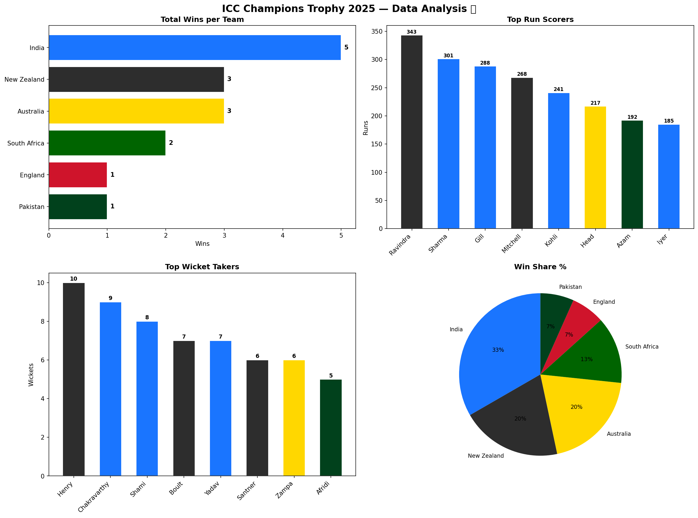

# ICC Champions Trophy 2025 — Data Analysis 🏆

A complete data analysis project on the ICC Champions Trophy 2025 using Python, Pandas, and Matplotlib.

---

## Overview

The ICC Champions Trophy 2025 was hosted by Pakistan after 29 years. India emerged as the unbeaten champions, winning all 5 of their matches. This project analyzes all 15 match results, team performance, top run scorers, and leading wicket takers.

---

## Key Findings

- 🏆 **India** won all 5 matches — completely unbeaten champions
- 🏏 **Rachin Ravindra** (NZ) — 343 runs, Player of Tournament
- 🎳 **Matt Henry** (NZ) — 10 wickets, top bowler
- 🇵🇰 **Pakistan** — only 1 win despite being host nation
- 📊 **Virat Kohli** — first batter to score 1,000 runs in ICC knockout matches

---

## Visualizations



---

## Tech Stack


---

## Project Structure

```
icc-champions-trophy-2025/
│
├── analysis.py                        # Main analysis script
├── champions_trophy_2025_analysis.png # Output visualization
├── requirements.txt                   # Dependencies
└── README.md
```

---

## How to Run

```bash
# 1. Clone the repository
git clone https://github.com/ahsanraza6925-prog/icc-champions-trophy-2025
cd icc-champions-trophy-2025

# 2. Install dependencies
pip install -r requirements.txt

# 3. Run the analysis
python analysis.py
```

---

## Tournament Summary

| Detail | Information |
|--------|-------------|
| Host | Pakistan + UAE |
| Dates | 19 Feb — 9 Mar 2025 |
| Teams | 8 |
| Matches | 15 |
| Champion | India (3rd title) |
| Runner-up | New Zealand |
| Player of Tournament | Rachin Ravindra |

---

## Author

**Ahsan Raza** — Data Science & AI Student
- GitHub: [@ahsanraza6925-prog](https://github.com/ahsanraza6925-prog)
- Kaggle: [@ahsanraza12](https://kaggle.com/ahsanraza12)

---

*This project is part of my Data Science learning journey.*
